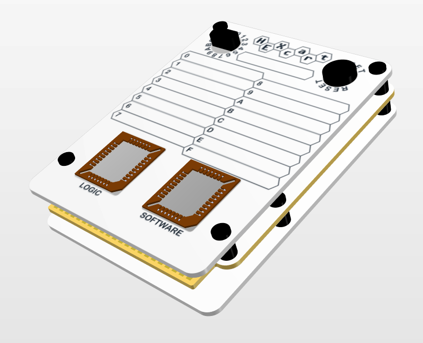
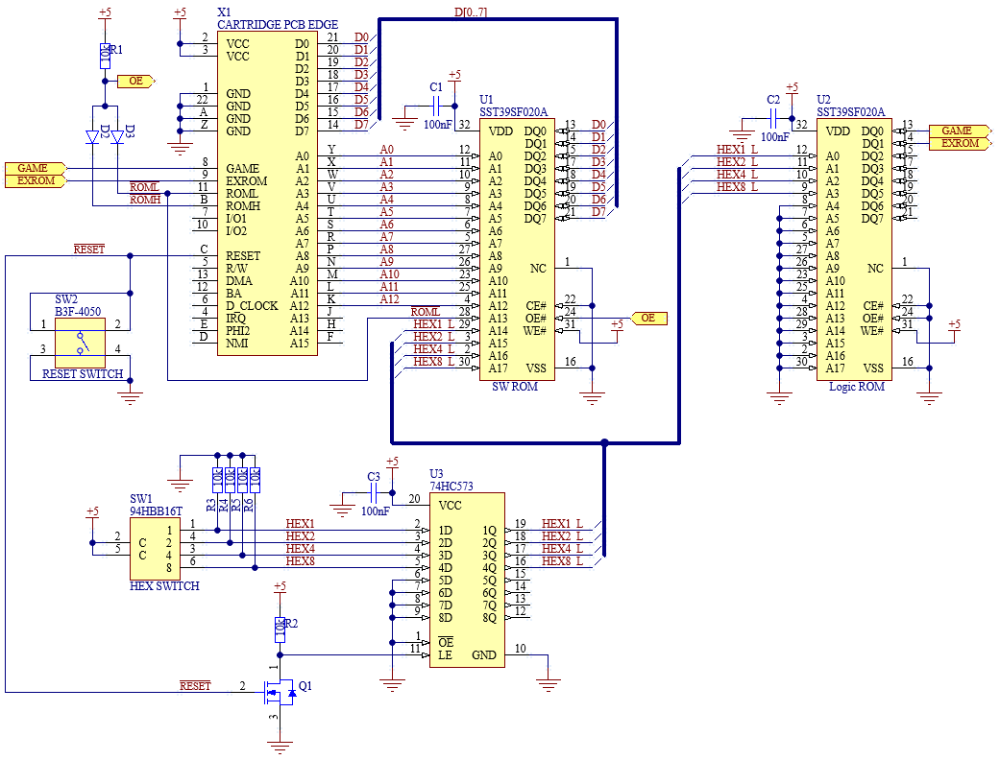
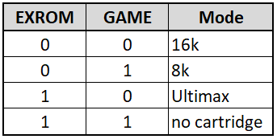

    

HEXcart is a cartridge for Commodore 64. It can fit 16pcs of 8 or 16kB ROM images and supports regular and ultimax ROMs. ROM is selected with a hex-switch. The cartridge was designed mainly for diagnostics use with different tools like Dead Test and Diagnostics. Selection is done with a hex-switch so it can be used with a faulty C64 without any selection menus.

    

## Theory of operation

    

HEXcart contains two flash ROM ICs U1 and U2. One is used for software and the other one is for logic. The softawe ROM IC must be at least 256kB in size to fit 16 pcs of 16kB ROM images.  
The logic ROM IC is used to set the EXROM and GAME signals to the correct state for regular or ultimax ROMs. No need for jumpers or switches.
The EXROM and GAME signals need to be in the correct state so the ROM is mapped into the correct address space. Notice the signals are active low.

    

The hex-switch outputs go to a transparent latch IC U3. The latch is used for saving the state of the hex-switch during power-up/reset. This allows to set the hex-switch to different position while the machine is on. The new selected ROM is activated at the next power-up/reset. The LE (latch Enable) input of the latch IC is low active. Reset signal is therefore inverted with fet Q1 and resistor R2. If you don't need this latch feature you can leave out U3, Q1 and R2. Circuit is then replaced with four jumpers shorting pads 2&19, 3&18, 4&17 and 5&16 of U3 bypassing it. Short positions are marked on the PCB.  
The latched hex-switch signals control the 4 highest address inputs of the software ROM IC. Therefore the hex-switch selects 16 different 16kB slots. The software ROM IC is enabled if either ROML or ROMH signal is low. This is done by diodes D2 and D3. The low active ROML and ROMH signals are used by the C64 to select low or high half of the 16kB ROM. That is why ROML signal must be connected to software ROM IC address pin A13.  
The hex-switch signals control the 4 lowest address inputs of the logic ROM IC. Therefore it selects one of the first 16 bytes. These bytes are used to program the type of the cartridge. Outputs DQ0 and DQ1 control the GAME and EXROM signals. For example if the fift 16kB slot in the software ROM IC contains a regular 16kB game then the fift byte of the logic ROM IC must have two lowest bits zero. 

## Parts

| Definition                             | Manufacturer         | Manufacturer PN       | Designator             | Quantity |
| -------------------------------------- | -------------------- | --------------------- | ---------------------- | -------- |
| CAP CER 100nF 50V X7R TH 200mil        | KEMET                | C330C104K5R5TA        | C1, C2, C3             | 3        |
| DIODE SMALL SIGNAL 100V AXIAL          | onsemi               | 1N4148                | D2, D3                 | 2        |
| MOSFET N-CH 60V 500MA TO92-3           | onsemi               | BS170-D27Z            | Q1                     | 1        |
| RES 10K OHM 1% 0.6W AXIAL              | Yageo                | MF0207FRE52-10K       | R1, R2, R3, R4, R5, R6 | 6        |
| SWITCH ROTARY DIP HEX 0.15A 42V        | Same Sky             | RDS3-16S-1065-1-D     | SW1                    | 1        |
| SWITCH TACTILE SPST-NO                 | Omron Electronics    | B3F-4050              | SW2                    | 1        |
| IC FLASH 2MBIT PARALLEL 32-PLCC        | Microchip Technology | SST39SF020A-70-4C-NHE | U1, U2                 | 2        |
| IC D-TYPE TRANSPARENT LATCH 8:8 20-DIP | Texas Instruments    | SN74HC573AN           | U3                     | 1        |
| SOCKET PLCC-32 TH                      | Adam Tech            | PLCC-32-AT            | (U1, U2)               | 2        |

| Definition       | Link                                                                                                           | Quantity |
| ---------------- | -------------------------------------------------------------------------------------------------------------- | -------- |
| PCB              | [https://jlcpcb.com/](https://jlcpcb.com/)                                                                     | 1        |
| Top cover PCB    | [https://jlcpcb.com/](https://jlcpcb.com/)                                                                     | 1        |
| Bottom cover PCB | [https://jlcpcb.com/](https://jlcpcb.com/)                                                                     | 1        |
| M3x4 screw       | [https://www.aliexpress.com/item/1005003640441632.html](https://www.aliexpress.com/item/1005003640441632.html) | 12       |
| M3x6 standoff    | [https://www.aliexpress.com/item/32832544494.html](https://www.aliexpress.com/item/32832544494.html)           | 8        |
| M3x8 set screw   | [https://www.aliexpress.com/item/1005005720795823.html](https://www.aliexpress.com/item/1005005720795823.html) | 2        |
| Reset switch hat | [https://www.aliexpress.com/item/1005006228397255.html](https://www.aliexpress.com/item/1005006228397255.html) | 1        |

## Schematic

[HEXcart PDF schematic](docs/HEXcart_R2_schematic.pdf)

