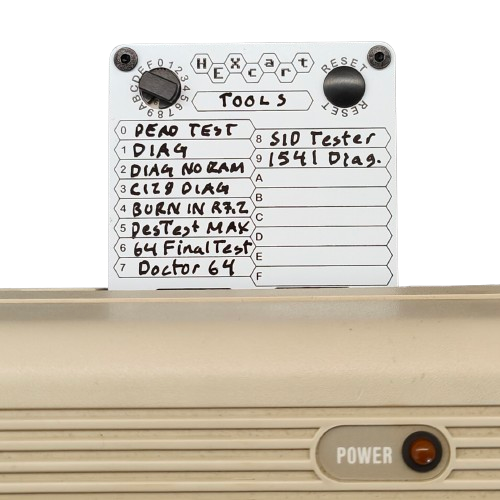

## Tools R0.1

    

This collection contains a selection of useful testing and diagnostics tools.

[Tools_LOGIC_0.1.bin](https://mega.nz/file/s4Az3RQC#0AALIILTO_BlQCfc2yuEHMHo9lShuli1kKE95MfMlTU) 
[Tools_SW_0.1.bin](https://mega.nz/file/B8wGnSYS#6B2Lxq8vH2qtsERWXBu3kW3TtjZFH5lJO6SVxY8QLxo)

| Slot | Name                               | Logic | Note        | Link                                                                                                                                                                                                                                   |
| ---- | ---------------------------------- | ----- | ----------- | -------------------------------------------------------------------------------------------------------------------------------------------------------------------------------------------------------------------------------------- |
| 0    | C64 Dead Test Rev 781220 kinzi 006 | 2     | Ultimax     | [https://www.forum64.de/index.php?thread/94841-dead-test-rev-781220-update-002-bis-006/&postID=1890851#post1890851](https://www.forum64.de/index.php?thread/94841-dead-test-rev-781220-update-002-bis-006/&postID=1890851#post1890851) |
| 1    | C64 Diag Rev 586220 kinzi 004      | 1     | 8k          | [https://www.forum64.de/index.php?thread/94841-dead-test-rev-781220-update-002-bis-006/&postID=1890851#post1890851](https://www.forum64.de/index.php?thread/94841-dead-test-rev-781220-update-002-bis-006/&postID=1890851#post1890851) |
| 2    | C64 Diagnostic 586220++ noramcheck | 1     | 8k          | [https://github.com/nharrer/c64_diagnostic_586220plus_noramcheck](https://github.com/nharrer/c64_diagnostic_586220plus_noramcheck)                                                                                                     |
| 3    | C128 Diagnostic Rev. 789010        | 3     | 8k C128     | [https://www.forum64.de/index.php?thread/94841-dead-test-rev-781220-update-002-bis-006/&postID=1890851#post1890851](https://www.forum64.de/index.php?thread/94841-dead-test-rev-781220-update-002-bis-006/&postID=1890851#post1890851) |
| 4    | C64 Burn In R7.2                   | 1     | 8k          | [https://blog.worldofjani.com/?p=164](https://blog.worldofjani.com/?p=164)                                                                                                                                                             |
| 5    | DesTestMAX                         | 2     | Ultimax     | [https://factorofmatt.com/destestmax](https://factorofmatt.com/destestmax)                                                                                                                                                             |
| 6    | 64 Final Test                      | 1     | 8k          | [https://blog.worldofjani.com/?p=164](https://blog.worldofjani.com/?p=164)                                                                                                                                                             |
| 7    | Roßmöller Doctor64                 | 1     | 8k          | [https://blog.worldofjani.com/?p=164](https://blog.worldofjani.com/?p=164)                                                                                                                                                             |
| 8    | SID Tester                         | 1     | 8k          | [https://github.com/asig/c64-sid-tester-cartridge/tree/master](https://github.com/asig/c64-sid-tester-cartridge/tree/master)                                                                                                           |
| 9    | 1541 diagnostics                   | 1     | 8k          | [https://blog.worldofjani.com/?p=2180](https://blog.worldofjani.com/?p=2180)                                                                                                                                                           |
| A    |                                    | FF    | Empty / OFF |                                                                                                                                                                                                                                        |
| B    |                                    | FF    | Empty / OFF |                                                                                                                                                                                                                                        |
| C    |                                    | FF    | Empty / OFF |                                                                                                                                                                                                                                        |
| D    |                                    | FF    | Empty / OFF |                                                                                                                                                                                                                                        |
| E    |                                    | FF    | Empty / OFF |                                                                                                                                                                                                                                        |
| F    |                                    | FF    | Empty / OFF |       

